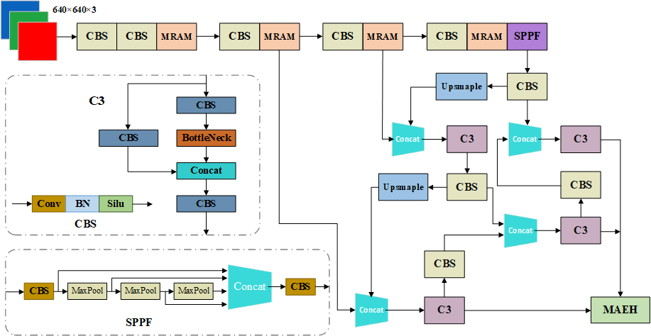
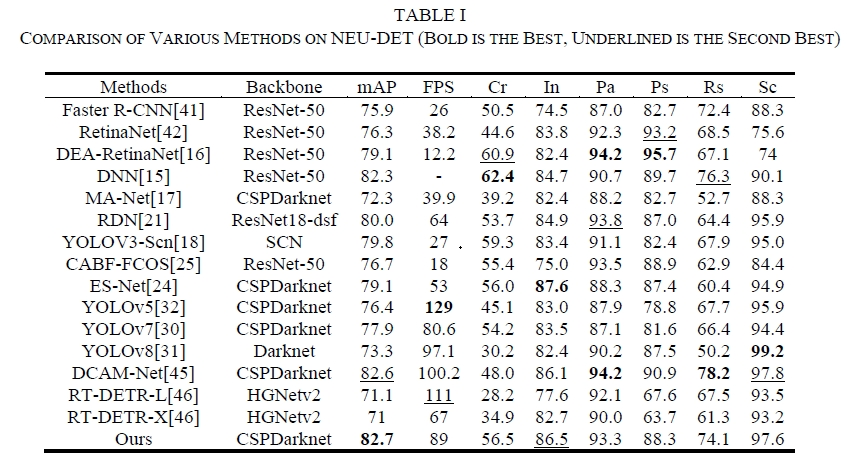
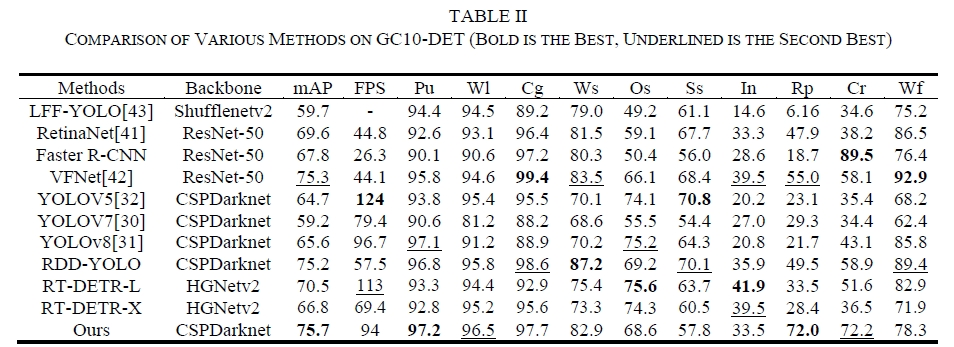
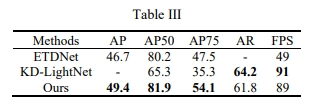
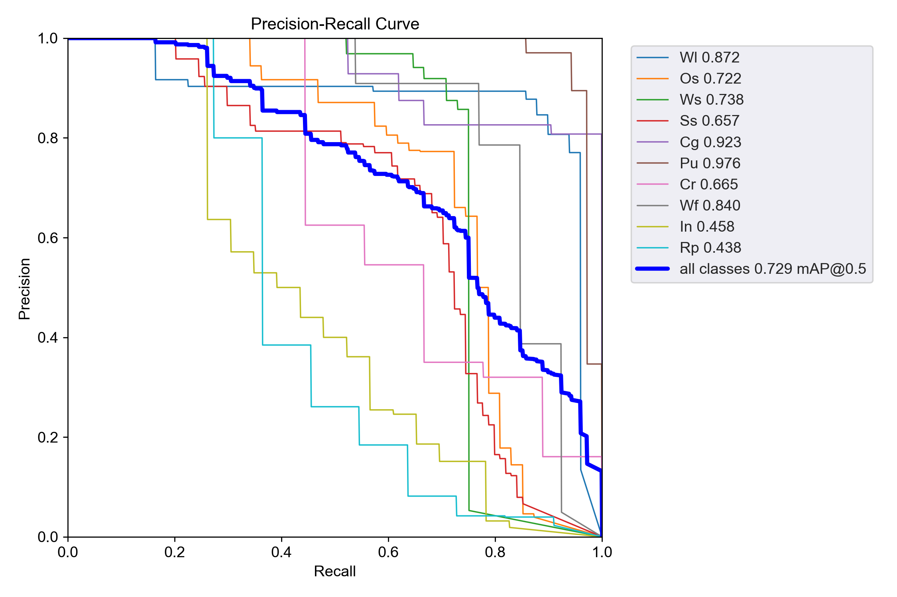
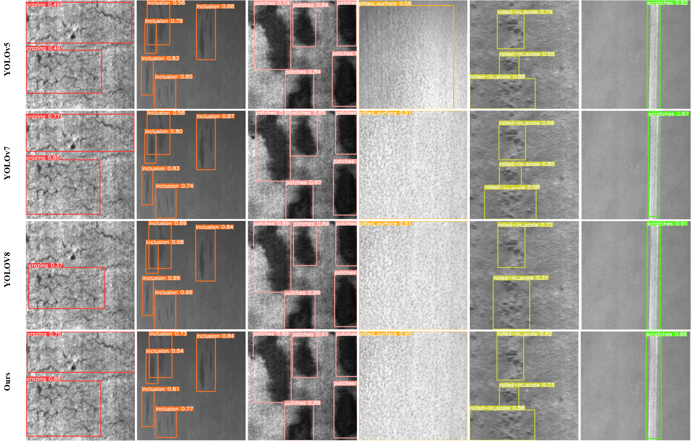
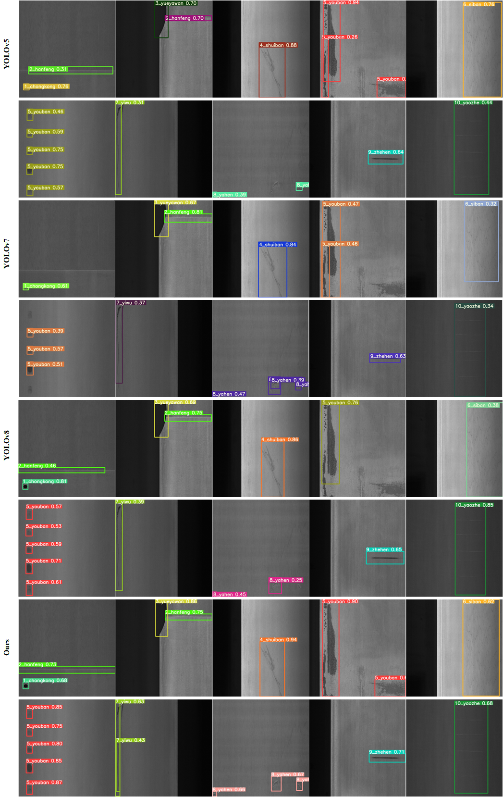

# Multi-Scale Sensing and Multi-Dimensional Feature Enhancement for Surface Defect Detection of Hot-rolled Steel Strip
## Introduction
Here is the paper we will publish "Multi-Scale Sensing and Multi-Dimensional Feature Enhancement for Surface Defect Detection of Hot-rolled steel strip". 

Please refer to the upcoming paper for more information.This repo is based on PyTorch.



## :open_file_folder: Datasets and Weight
 - NEU-DET: [Google Drive](https://drive.google.com/file/d/1Ki4GqtnGQqE67DvWUY3p7YJWSBZOgB8S/view?usp=drive_link); 


## 🚀 Training
More configuration please see train.py and where you can set dataset path, batch size, weight path, and so on.

## Packages
The following packages must be installed to use this project.
```
pip install -U openmim
mim install mmengine
mim install "mmcv>=2.0.0"
```

## :trophy: Result
Our proposed method achieves better performance on NEU-DET and GC10-DET.The specific indicators are shown in Table I and Table II.



In addition, we use the COCO evaluation metric to compare with ETDNet and KD-LightNet, and the results are shown in Table III.



PR_curve


## Visualization of detection results
Compared with the YOLO series methods, our method is more accurate in NEU-DET and GC10-DET.

NEU-DET



GC10-DET


