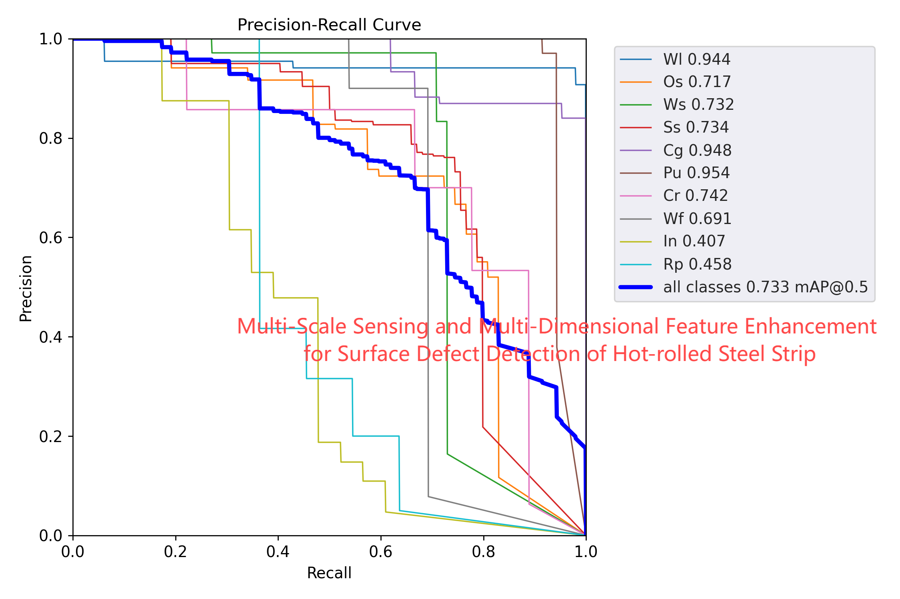

# Multi-Scale Sensing and Multi-Dimensional Feature Enhancement for Surface Defect Detection of Hot-rolled Steel Strip
## Introduction
Here is the paper we publish "Multi-Scale Sensing and Multi-Dimensional Feature Enhancement for Surface Defect Detection of Hot-rolled steel strip". 

Please refer to the paper for more information. This repo is based on PyTorch.

## :open_file_folder: Dataset and Weight
GC10-DET [Google Drive](https://drive.google.com/drive/folders/1il-h-ijcIpq4LUIcwOvegy7BqeBCabf9?usp=drive_link)

NEU-DET  [Google Drive](https://drive.google.com/drive/folders/1A0UFpEhH_Wa98OvncSeX5IXnuCNOyF-J?usp=drive_link)

MDGC10-DET [Google Drive](https://drive.google.com/drive/folders/1il-h-ijcIpq4LUIcwOvegy7BqeBCabf9?usp=drive_link)

Weights [Google Drive](https://drive.google.com/file/d/1Ki4GqtnGQqE67DvWUY3p7YJWSBZOgB8S/view?usp=drive_link)  [Google Drive]()

## 🚀 Training
More configuration please see train.py and where you can set dataset path, batch size, weight path, and so on.

## trophy: Packages
The following packages must be installed to use this project.
```
pip install -U openmim
mim install mmengine
mim install "mmcv>=2.0.0"
```

## 🔍: Result

⭐PR_curve


⭐PR_curve


